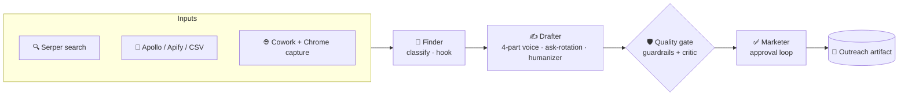

<div align="center">

# 🤝 Networking Agent


**An autonomous, 3-agent networking pipeline for job seekers — built as a Claude Code plugin.**
It finds the right people at a target company, drafts outreach in *your* voice (not generic AI mush), runs it through a quality gate, and walks you through approval — all from slash commands.

<br/>


[Why it exists](#-why-it-exists) · [Features](#-features) · [How it works](#-how-it-works) · [Quick start](#-quick-start) · [Commands](#-commands) · [Roadmap](#-roadmap) · [Docs](#-documentation)

</div>

---

## 💡 Why it exists

The job funnel is flooded with AI-generated noise — applications surged **45.5%** while postings *dropped*, popular roles draw **200–400 applicants in 48 hours**, and recruiters now spot generic AI outreach in ~20 seconds and reject it. Mass-applying is a losing game.

The one thing that still works: a **warm referral**. Referred candidates are hired at **~28.5% vs ~2.7%** for cold applicants — roughly **10×**. And a *personalized* connection note gets **72% more replies** than a generic one. The rule that wins is **"5 personalized messages to the right people beat 50 generic ones."**

**Networking Agent automates the *right* way to do this** — deep personalization, the right contacts, one company at a time — instead of the spray-and-pray that's now actively penalized.

> 🧭 **Any field.** The agent is profile-driven: `/network-setup` interviews you and builds your profile, voice, and resume library — a backend engineer, a nurse, and an aerospace stress analyst all run the same pipeline with different profiles.

---

## ✨ Features

| | |
|---|---|
| 🎯 **Finds the right people** | Discovers contacts at a target company and classifies them by persona (alumni · hiring manager · peer · recruiter) — alumni-first, because they reply 60–80% of the time. |
| ✍️ **Your voice, not generic AI** | A validated **4-part message model** (Intro → Source → Hook → Close), specialized per persona, grounded in your résumé and `voice.md`. |
| 🔄 **Ask-rotation** | Several contacts at the same company get **different** questions (sponsorship, who-to-talk-to, culture, transition…) so a batch reads as real outreach, not one copied script. |
| 🧹 **Humanizer + quality gate** | A deterministic tell-stripper plus **hard guardrails + a Sonnet critic** catch fabrication, placeholders, over-length notes, and AI tics before anything reaches you. |
| 📥 **Bring leads from anywhere** | Source-agnostic import — **Apollo, Apify, a Cowork + Chrome capture, or a hand-made CSV/JSON** all normalize into one pipeline. `/network-import leads.csv --draft`. |
| 🔒 **Local-first & private** | Your keys, a local SQLite DB, `chmod 600` config enforcement, and one-command GDPR purge. Nothing leaves your machine beyond contact discovery. |
| 💸 **Free-tier friendly** | Zero-cost defaults (no paid email lookups), search caching, and ~**$0.15–0.30 per company** in Claude usage. |

---

## 🛠 How it works



Three agents, one state machine (`NEW → FOUND → SELECTED → DRAFTED → APPROVED → SENT`).
`/network-run` always resumes from the current state, so it's safe to re-run after an interruption.

---

## 🚀 Quick start

> **Prerequisites:** Python 3.11+ · Claude Code with plugin support · a discovery key (free Serper tier or Apify). No Anthropic API key needed — the default flow runs on your Claude session's own tokens; a key only enables the headless `--api` fallback. Hunter/Apollo email enrichment is opt-in.

```bash
# 1. Install the plugin
claude plugin install https://github.com/Siddardth7/networking-agent

#    …or run it locally from a clone:
claude --plugin-dir ./networking-agent

# 2. Onboard — a guided interview builds your profile, voice, and
#    resume library (any field, not just aerospace):
/network-setup

# 3. Go — Campaign mode (build a bench at a target company)…
/network-run spacex          # aerospace example
/network-run stripe          # …but any field works: SWE,
/network-run mayo-clinic     # nursing, finance, whatever your profile says

# …or Application mode (referrals for specific postings you're applying to)
/network-jobs runs/applications/2026-07-02-feed.json
```

Prefer manual setup? Copy `config/default.yaml` → `~/.networking-agent/config.yaml`
(`chmod 600`), fill your keys, and adapt `config/profile.example.yaml`,
`config/voice.example.md`, and `config/resume_library.example.yaml` next to it.
Either way, `/network-check` tells you exactly what's missing **before** you
spend any API credits.

<details>
<summary><b>⚙️ Configuration details</b></summary>

```yaml
# ~/.networking-agent/config.yaml
keys:
  anthropic_api_key: "sk-ant-..."
  serper_api_key: "..."          # free tier is plenty
  hunter_api_key: "..."          # optional — only for cold-email lookups

providers:
  serper_monthly_limit: 100
  search_cache_ttl_days: 14      # repeat runs on a company are free

pipeline:
  finder_limit: 5
  enable_email_enrichment: false # opt-in; off = zero Hunter spend

quality:
  linkedin_char_limit: 280
  email_word_limit: 150
  enable_critic: true
  opener_max_repeats: 2
  enable_ask_rotation: true
```

**Environment variables** (`ANTHROPIC_API_KEY`, `SERPER_API_KEY`, `HUNTER_API_KEY`) take precedence over the file if you prefer not to write keys to disk.

**🔐 Trust model:** the full text of `voice.md` and your `resume_library.yaml` bullets is embedded verbatim in every drafting prompt — treat them like code you wrote. Only use voice templates you've read and trust.

</details>

---

## 🧩 Commands

| Command | Description |
|---|---|
| `/network-setup` | **Guided onboarding** — an interview that builds your profile, voice, and resume library (any field). |
| `/network-coach` | The strategy, explained — why alumni-first, why one ask, what to do with each reply. |
| `/network-check` | Preflight — verifies keys, DB integrity, config permissions, and `voice.md`. |
| `/network-run <slug>` | Full pipeline (find → select → draft → approve → artifact), resumes from state. |
| `/network-find <slug>` | Discover + classify contacts only; stops before drafting. |
| `/network-import <file>` | **Import leads from any source** (Apollo/Apify/Cowork/CSV) and optionally `--draft`. |
| `/network-draft <slug>` | Generate drafts for selected contacts. |
| `/network-approve <slug>` | Enter the approval loop. |
| `/network-status [slug]` | Pipeline state for one company or all. |
| `/network-dry-run <slug>` | Simulate a run — no API calls, no writes. |
| `/network-providers` | Show API quota usage / remaining credits. |
| `/network-purge [slug]` | Delete stored data (GDPR) for one company or all. |

---

## 🛡️ Quality gate

Every draft passes three layers before it can be approved:

1. **Generation-fault regen** — blocklist phrases, placeholder tokens, multi-asks, repeated intros, and over-used openers each trigger one corrective regeneration.
2. **Hard guardrails (deterministic)** — fabricated metrics, surviving placeholders, and over-length messages are `HARD_FAIL`ed (and redacted) — unapprovable without `--force`.
3. **Critic (Sonnet)** — six rubric dimensions; a draft is held (`CRITIC_HOLD`) only on a severe or multiply-weak score, with a persisted `Held because:` reason.

Faults that survive their regen are `SOFT_FLAG`ged — visible but approvable. Tune everything under `quality:` in `config.yaml`.

---

## 🗺️ Roadmap

**v1.0 shipped** — the public release. Phase A (harden: all input sources, Finder accuracy scorecards, referral-likelihood ranking, email channel, reply → follow-up → conversation loop) and Phase B (host-token architecture — no API topup; Application mode — per-job-posting referrals; profile-driven generalization; guided onboarding + coaching; public polish with live validation) are complete. Post-1.0 candidates (early-applicant timing, non-dev surfaces) are tracked in the roadmap doc.

📖 Full version ladder and rationale: **[docs/ROADMAP.md](docs/ROADMAP.md)** · market thesis: **[docs/MARKET_GAP_AND_FEATURE_IDEAS](docs/MARKET_GAP_AND_FEATURE_IDEAS_2026-06-21.md)** · want to help? **[CONTRIBUTING.md](CONTRIBUTING.md)**.

---

## 📚 Documentation

Everything lives in **[`docs/`](docs/README.md)** (indexed): the roadmap, sourcing research, the source-agnostic input design, the Cowork + Chrome producer contract, cost breakdown, and trial scorecards.

---

## 💸 Cost

All AI calls use `claude-haiku-4-5` (Sonnet for the critic). **~$0.15–0.30 per company** with free-tier defaults; re-running the same company is essentially free (search responses are cached). See **[docs/COSTS.md](docs/COSTS.md)**.

---

<details>
<summary><b>🩺 Troubleshooting</b></summary>

- **`ANTHROPIC_API_KEY not set or invalid`** → set it in `config.yaml` under `keys.anthropic_api_key` or export it; verify at [console.anthropic.com](https://console.anthropic.com).
- **`config.yaml permissions too open (expected 600)`** → `chmod 600 ~/.networking-agent/config.yaml`.
- **`Serper/Hunter quota exhausted`** → check `/network-providers`; use `/network-dry-run` to test without spend.
- **`voice.md not found`** → `cp config/voice.example.md ~/.networking-agent/voice.md` (the run continues with a neutral tone otherwise).
- **`DB integrity check failed`** → the SQLite DB is at `~/.networking-agent/state.db`; `/network-purge` to clear a company, or delete `state.db` to reset everything.

</details>

---

## 🤝 Contributing

Issues and PRs welcome. The project is in active development toward a public v1.0 — see the [roadmap](docs/ROADMAP.md) for where it's headed. Run the suite with `pytest` (562 tests, ~90% coverage) and lint with `ruff check`.

## 📄 License

MIT — see [LICENSE](LICENSE).

<div align="center">
<br/>
<sub>Built with ❤️ and <a href="https://claude.com/claude-code">Claude Code</a> · Started to help friends land interviews.</sub>
</div>
