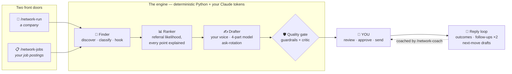

<div align="center">

# 🤝 Networking Agent


### The referral engine for your job search — built as a Claude Code plugin.

It finds the **right people** at a company (or for a specific job posting), ranks them by
who's actually likely to help, drafts outreach in **your voice** under hard anti-fabrication
guardrails, and coaches you through every reply — **on your own Claude tokens. No API bill.**

<br/>

[](https://github.com/Siddardth7/networking-agent/actions/workflows/ci.yml)
[](https://github.com/Siddardth7/networking-agent/releases)
[](LICENSE)


[](https://claude.com/claude-code)

**[Why](#-the-problem)** · **[See it work](#-see-it-work)** · **[Quick start](#-quick-start-3-commands)** · **[How it works](#-how-it-works)** · **[Commands](#-command-reference)** · **[Trust](#%EF%B8%8F-why-you-can-trust-the-drafts)** · **[FAQ](#-faq)**

<sub>⭐ If this saves you one cold application, star it — it helps other job seekers find it.</sub>

</div>

---

## 💡 The problem

The job funnel is drowning in AI noise. Applications surged **45.5%** while postings *dropped*.
Popular roles draw **200–400 applicants in 48 hours**. Recruiters spot generic AI outreach in
**~20 seconds** and bin it. Mass-applying is a losing game — and the tools that "help" you
mass-apply are making it worse.

What still works is embarrassingly old-fashioned: **a warm referral.**

<div align="center">

| | 📨 Cold application | 🤝 Warm referral |
|---|:---:|:---:|
| Hire rate | ~2.7% | **~28.5%** (≈10×) |
| Reply rate to generic notes | baseline | **+72%** when personalized |
| What recruiters do with it | auto-triage | actually read it |

</div>

**The winning rule: 5 personalized messages to the right people beat 50 generic ones.**
That's the entire design philosophy of this agent — it automates the *right* way to network,
not the spray-and-pray that's now actively penalized.

> [!NOTE]
> **Works for any field.** The agent is profile-driven: a guided interview builds *your*
> profile, voice, and resume library. A backend engineer, an ICU nurse, and an aerospace
> stress analyst run the same pipeline with different profiles. (Proven in a
> [live end-to-end trial](docs/TRIAL_B4_NONAEROSPACE_2026-07-02.md).)

---

## 🎬 See it work

Everything happens in your Claude Code session. Here's the real flow, condensed
(the candidates, ranks, and draft below are from the actual live validation trial):

**1 · Onboard once — a conversation, not a config file**

```text
you    ❯ /network-setup

agent  ◆ Nothing configured yet — let's build your profile.
         What field are you in, and what roles are you hunting?

you    ❯ Backend engineering — distributed systems roles.

agent  ◆ Proposing a focus taxonomy for your field:
           BACKEND  ·  distributed systems / APIs / services
           INFRA    ·  infrastructure / platform / SRE
         Look right? We'll also capture your school, past employers,
         and target titles — they become your warm-signal detectors.
         …
         ✔ profile.yaml           written (backed up on every change)
         ✔ voice.md               written — drafts will sound like YOU
         ✔ resume_library.yaml    written — the only facts drafts may use
         ✔ /network-check         all green
```

**2 · Run a company — ranked people, with reasons**

```text
you    ❯ /network-run cloudflare

agent  ◆ Discovered & classified 3 people. Ranked by referral likelihood:

         1. John Knudson — Distributed Systems Engineering        [17 pts]
            why: focus matches your target role (+10) · engineer who
            can refer (+5) · reachable (+2)
            hook: "prior Senior Backend Engineer at Agora"

         2. Daniel Rivas — Systems Engineer, 8+ yrs distributed    [17 pts]
         3. Jose I.     — Systems Engineer, backend-lean           [17 pts]

         Who should I draft for?
```

**3 · Drafts in your voice — gated, explained, yours to approve**

```text
agent  ◆ Draft for John (LinkedIn note · 264/280 chars):

         │ Hi John, I'm finishing my MS CS at Georgia Tech (distributed
         │ systems) and came across your profile — the path from senior
         │ backend at Agora to distributed-systems work at Cloudflare
         │ caught my eye. Would value connecting and hearing what the
         │ work is actually like.

         ✔ guardrails OK  ·  ✔ critic OK  ·  every fact traced to your resume
         The ask is rotated: John gets "what's the work like", Daniel gets
         "how did you break in" — a batch never reads as one copied script.

         APPROVE · SKIP · REVISE ?
```

**4 · They replied? The agent knows the next move**

```text
you    ❯ /network-outcome 1 REPLIED --notes "says they're hiring on his team"

agent  ◆ Reply mentions hiring → next move: REFERRAL_ASK.
         This is the moment the thread was building toward. Draft ready —
         one ask, thanks first, in your voice. (/network-coach explains why.)
```

> [!TIP]
> Applying to **specific postings**? `/network-jobs feed.json` is the second front door:
> it finds referral candidates **per job posting**, links them to each `job_id`, and answers
> *"do I have a referral for this req yet?"* while you decide to apply or drop.

---

## 🚀 Quick start (3 commands)

> **Prerequisites:** Python 3.11+ · [Claude Code](https://claude.com/claude-code) ·
> one discovery key ([Serper](https://serper.dev) free tier is plenty, or Apify).
> **No Anthropic API key needed** — the pipeline runs on your Claude session's own tokens.

```bash
# 1 · Install (then restart Claude Code so the /network-* commands load)
claude plugin marketplace add https://github.com/Siddardth7/networking-agent
claude plugin install networking-agent@networking-agent
```
```text
# 2 · Onboard (guided interview — any field, ~10 minutes)
/network-setup
```
```text
# 3 · Go
/network-run stripe                  # Campaign mode: build a bench at a company
/network-jobs my-postings.json       # Application mode: referrals per job posting
```

That's genuinely it. `/network-check` (the doctor) runs at the end of setup and tells you
exactly what's missing **before** anything spends a credit.

> **No manual `pip install` or venv.** The first `/network-*` command you run bootstraps an
> isolated Python environment at `~/.networking-agent/.venv` automatically (one-time, ~20s),
> then reuses it. Works wherever Claude Code installed the plugin — no repo clone required.
>
> **Windows:** ships with both runners — `bin/nag` (bash: macOS/Linux/WSL/Git-Bash) and
> `bin/nag.ps1` (native PowerShell). The commands reference `bin/nag`; on native PowerShell the
> equivalent is `& "$env:CLAUDE_PLUGIN_ROOT\bin\nag.ps1" src.cli.<module>`. Requires
> Python 3.11+ on PATH (the `py` launcher is auto-detected).

<details>
<summary><b>⚙️ Manual setup & configuration reference</b></summary>
<br/>

Prefer files over interviews? Copy and adapt:

```bash
mkdir -p ~/.networking-agent
cp config/default.yaml              ~/.networking-agent/config.yaml   # then: chmod 600
cp config/profile.example.yaml      ~/.networking-agent/profile.yaml
cp config/voice.example.md          ~/.networking-agent/voice.md
cp config/resume_library.example.yaml ~/.networking-agent/resume_library.yaml
```

```yaml
# ~/.networking-agent/config.yaml
keys:
  serper_api_key: "..."            # discovery — free tier is plenty
  apify_api_key: "..."             # optional richer discovery lane
  anthropic_api_key: "sk-ant-..."  # optional — ONLY for the headless --api fallback
  hunter_api_key: "..."            # optional — cold-email lookups (off by default)

providers:
  serper_monthly_limit: 100
  search_cache_ttl_days: 14        # re-running a company is free

pipeline:
  finder_limit: 5
  enable_email_enrichment: false   # opt-in; off = zero Hunter spend

quality:
  linkedin_char_limit: 280
  email_word_limit: 150
  enable_critic: true
  enable_ask_rotation: true
```

Environment variables (`SERPER_API_KEY`, `APIFY_API_KEY`, `ANTHROPIC_API_KEY`,
`HUNTER_API_KEY`) take precedence over the file.

**🔐 Trust model:** the full text of `voice.md` and your resume bullets is embedded verbatim
in every drafting prompt — treat them like code you wrote. Only use templates you've read.

</details>

<details>
<summary><b>🩺 Troubleshooting</b></summary>
<br/>

- **`config.yaml permissions too open (expected 600)`** → `chmod 600 ~/.networking-agent/config.yaml`
- **`Serper/Hunter quota exhausted`** → `/network-providers` shows remaining credits; `/network-dry-run` tests without spend
- **`voice.md not found`** → run `/network-setup`, or `cp config/voice.example.md ~/.networking-agent/voice.md`
- **Drafts carry the wrong identity** → your profile needs its own persona templates: re-run `/network-setup` (step 3.5 writes them)
- **`DB integrity check failed`** → state lives in `~/.networking-agent/state.db`; `/network-purge <slug>` clears a company, deleting the file resets everything

</details>

---

## 🛠 How it works

**One engine, two front doors, and a human hand on the send button.**



The architecture inverts the usual agent design: **your Claude session's model does the
judgment** (classify, draft, critique) while deterministic Python does everything that must
never hallucinate — discovery HTTP, dedup, ranking math, guardrail regexes, scheduling,
persistence. A state machine (`NEW → FOUND → SELECTED → DRAFTED → APPROVED`) makes every
run resumable: interrupt anywhere, `/network-run` picks up exactly where it left off.

| | |
|---|---|
| 🎯 **Ranked, not scraped** | Deterministic referral-likelihood scoring: confirmed alumni **+40**, 1st-degree **+30**, recruiter **+20**, on-the-target-team **+10**… every point comes with its reason attached. |
| ✍️ **Your voice, enforced** | A validated 4-part model (Intro → Source → Hook → Close) with a hard **specificity gate**: a hook either names something real from *their* profile or gets omitted. No filler, ever. |
| 🚫 **Fabrication is impossible-by-design** | Drafts may only state facts from your provenance-tagged resume library. Coursework is never dressed up as employment. Invented metrics are `HARD_FAIL`ed. |
| 🔄 **Ask-rotation** | Five alumni at one company get five *different* questions — sponsorship, culture, who-to-talk-to, their transition — so short replies compose into the full picture. |
| 🔁 **The whole loop** | Capped follow-ups (2 touches, 4–7-day gap), timezone-aware send windows (Tue–Thu ~9am *their* time), reply classification → next-move drafts. |
| 🎓 **A coach, not just a tool** | `/network-coach` explains the strategy in terms of the agent's real mechanics, and the pipeline gives one-line whys as it presents each candidate and draft. |
| 📥 **Leads from anywhere** | Apollo, Apify, browser captures, hand-made CSV/JSON — everything normalizes into one pipeline: `/network-import leads.csv --draft`. |
| 🔒 **Local-first & private** | Your keys, a local SQLite DB, `chmod 600` enforced, one-command GDPR purge. The agent **never touches LinkedIn** — discovery is off-platform and *you* send. |

---

## 🧩 Command reference

<details open>
<summary><b>Getting started</b></summary>

| Command | What it does |
|---|---|
| `/network-setup` | 🧙 Guided onboarding — builds your profile, voice, persona templates, and resume library. Re-runnable; every overwrite is backed up. |
| `/network-coach` | 🎓 The strategy, explained — why alumni-first, why one ask, what each reply means. |
| `/network-check` | 🩺 The doctor — verifies keys, DB, permissions, and config before you spend anything. |

</details>

<details open>
<summary><b>The two front doors</b></summary>

| Command | What it does |
|---|---|
| `/network-run <slug>` | 🏢 **Campaign mode** — full pipeline for a company: find → rank → select → draft → critic → approve. Resumes from state. |
| `/network-jobs <feed.json>` | 📋 **Application mode** — per-posting referral candidates linked to each `job_id`; `--status` answers "referral for this req yet?". |

</details>

<details>
<summary><b>Pipeline pieces (run any stage on its own)</b></summary>

| Command | What it does |
|---|---|
| `/network-find <slug>` | Discover + classify contacts, stop before drafting. |
| `/network-import <file>` | Import leads from any source; `--draft` to draft immediately. |
| `/network-draft <slug>` | Draft for selected contacts. |
| `/network-approve <slug>` | The approval loop (APPROVE / SKIP / REVISE) → outreach artifact. |
| `/network-dry-run <slug>` | Simulate a full run — zero API calls, zero writes. |

</details>

<details>
<summary><b>After you send</b></summary>

| Command | What it does |
|---|---|
| `/network-outcome <id> <OUTCOME>` | Record what happened (replied / intro / sponsorship / declined); `--report` for the funnel. |
| `/network-nextmove <id>` | They replied — classify the reply and draft the right next move. |
| `/network-followups` | Schedule capped follow-ups (2 max, 4–7-day gap) for approved, unanswered outreach. |
| `/network-timing` | Best send window per contact, in *their* timezone. |
| `/network-status [slug]` | Pipeline state, one company or all. |
| `/network-providers` | Quota / credits remaining per provider. |
| `/network-purge [slug]` | Delete stored data (GDPR) — one company or everything. |

</details>

---

## 🛡️ Why you can trust the drafts

Every message passes three layers before you ever see it:

1. **Corrective regeneration** — blocklisted phrases, placeholder tokens, multi-asks,
   repeated self-intros, and over-used openers each trigger one targeted rewrite.
2. **Hard guardrails (deterministic)** — fabricated metrics, surviving placeholders, and
   over-length notes are `HARD_FAIL`ed and redacted. Unapprovable without `--force`.
3. **The critic** — a six-dimension rubric (specificity, grounded facts, one-ask, tone,
   relevance, economy) plus a curated **AI-tell scanner**; anything that smells generated
   is held with a persisted *"Held because:"* reason.

And the numbers behind the badge row: **1,270 hermetic tests** at **98.9% line+branch
coverage** (CI-gated), opt-in **live-API smoke tests** against the real providers, live
accuracy scorecards (persona classification **100%**, focus **100%**, ranking **100%
pairwise concordance**), and a [live end-to-end trial on a non-aerospace
profile](docs/TRIAL_B4_NONAEROSPACE_2026-07-02.md).

---

## ❓ FAQ

<details>
<summary><b>Does this spam people on LinkedIn for me?</b></summary>
<br/>
No — by design. The agent never touches LinkedIn. It finds people off-platform, writes
drafts, and <b>you</b> review and send every message. It also refuses to write generic
notes: if there's nothing specific to say to someone, the draft gets <i>shorter</i>, not
padded. The whole thesis is anti-spam.
</details>

<details>
<summary><b>What does it cost to run?</b></summary>
<br/>
The default flow costs <b>no API money</b> — classification, drafting, and critique run on
your Claude session's own tokens. Discovery uses a free-tier Serper key (100 searches/mo,
cached so re-runs are free) or Apify. Optional extras: Hunter/Apollo email enrichment
(off by default) and a headless <code>--api</code> mode (~$0.15–0.30/company —
<a href="docs/COSTS.md">breakdown</a>).
</details>

<details>
<summary><b>I'm not an engineer. Will it work for my field?</b></summary>
<br/>
Yes. <code>/network-setup</code> interviews you and proposes a focus taxonomy for
<i>your</i> field — the classifier, hooks, ranking, and drafts all follow your profile.
The live validation trial ran a backend engineer; the wizard docs walk through a nurse.
Nothing about any field is hardcoded.
</details>

<details>
<summary><b>Will recruiters/contacts be able to tell it's AI?</b></summary>
<br/>
That's the problem this project obsesses over. Drafts are grounded in your real resume
facts and voice doc, pass a deterministic AI-tell scanner (the phrases everyone
recognizes are blocklisted), get one specific detail from the recipient's actual profile
or say less, and are capped at human lengths. Then <b>you</b> approve and send — so the
final judgment is always yours.
</details>

<details>
<summary><b>Where does my data live?</b></summary>
<br/>
On your machine: a local SQLite DB and YAML/markdown files under
<code>~/.networking-agent/</code> (config enforced to <code>chmod 600</code>).
<code>/network-purge</code> deletes everything about a company — or everything, period.
</details>

---

## 🗺️ Roadmap & docs

**v1.0 shipped** — Phase A (hardening: input sources, Finder accuracy scorecards,
referral ranking, email channel, the reply loop) and Phase B (host-token architecture,
Application mode, profile-driven generalization, guided onboarding + coaching, public
polish with live validation) are complete. Post-1.0 candidates (early-applicant timing,
non-dev surfaces) live in the roadmap.

📖 **[docs/](docs/README.md)** — the full index: [ROADMAP](docs/ROADMAP.md) ·
[market thesis](docs/MARKET_GAP_AND_FEATURE_IDEAS_2026-06-21.md) ·
[cost breakdown](docs/COSTS.md) · design docs & trial scorecards.

## 🤝 Contributing

PRs welcome — **[CONTRIBUTING.md](CONTRIBUTING.md)** has the dev setup, the CI bar
(98% branch-coverage gate, ruff), and the architecture ground rules. Good first
contribution: an example profile for a field we don't cover yet.

## 📄 License

MIT — see [LICENSE](LICENSE).

<div align="center">
<br/>

**If this helped you skip even one cold application, [⭐ star the repo](https://github.com/Siddardth7/networking-agent) — it's how other job seekers find it.**

<sub>Built with ❤️ and <a href="https://claude.com/claude-code">Claude Code</a> · started to help friends land interviews.</sub>

</div>
